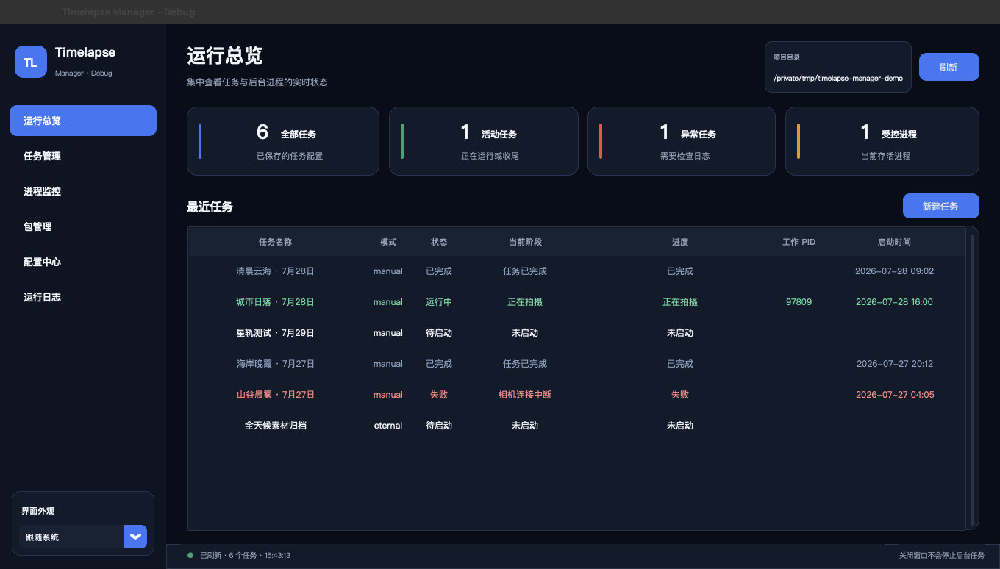
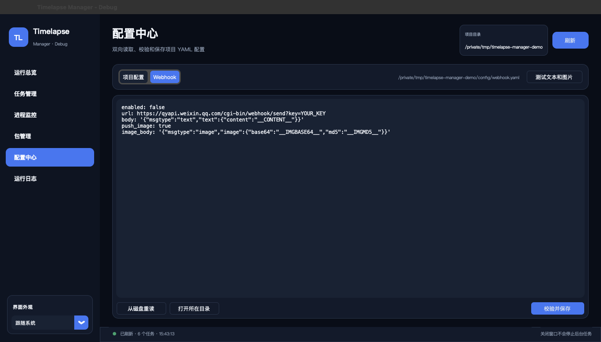

# Timelapse Manager

[English](README.md) | [简体中文](README_CN.md)



Timelapse Manager is a cross-platform GUI and CLI for scheduling, running, and monitoring timelapse capture workflows. It connects Camera Timelapse Controller, Bracketlapse, optional SunsetScore analysis, and notifications in one persistent task manager.

Closing the GUI does not stop background tasks. Reopen it at any time to inspect progress, logs, and processes.

## Main Features

- Create manual, one-time scheduled, recurring, or continuous capture tasks.
- Monitor task status, progress, logs, worker processes, and child tools.
- Run capture and post-processing as restartable background workflows.
- Edit validated YAML configuration from the GUI.
- Inspect and install supported workflow dependencies.
- Send optional WeCom text and image notifications.

## Run the Project

### Requirements

- Python 3.10 or newer.
- Tk support in the selected Python installation.
- Camera Timelapse Controller for real capture.
- Bracketlapse when post-processing is enabled.

The GUI can start before the external workflow tools are installed. Use **包管理 (Package Management)** after startup to inspect or install supported dependencies.

### Download

```bash
git clone https://github.com/hanwenphotograph/Timelapse-Auto-Script.git
cd Timelapse-Auto-Script
```

Downloading and extracting the repository ZIP also works.

### macOS

Double-click `start_gui.command`. It selects or creates a virtual environment, installs missing Python packages, checks Tk, and starts the GUI with the `TL` Dock icon.

### Windows

Double-click `start_gui.bat`. It performs the same environment and package checks before starting the GUI.

### Linux

```bash
python3 -m venv .venv
source .venv/bin/activate
python -m pip install -r requirements.txt
python timelapse.py gui
```

On Debian or Ubuntu, install Tk first when needed:

```bash
sudo apt install python3-tk
```

If you use a packaged Release build, open `TimelapseManager.app` on macOS or the `TimelapseManager` executable on Windows and Linux.

## First Use

1. Open **包管理 (Package Management)** and check Camera Timelapse Controller and Bracketlapse.
2. Open **配置中心 (Configuration)** to review capture times, output location, and external commands.
3. Open **任务管理 (Task Management)**, select **新建任务 (New Task)**, enter a name, and choose a preset.
4. Use **运行总览 (Runtime Overview)**, **进程监控 (Process Monitoring)**, and **运行日志 (Logs)** to follow the task.
5. Use the task actions to finish gracefully, finish after the current round, or stop immediately.

| Preset | Use it for |
| --- | --- |
| `scheduled_once` | The next configured morning or dusk window. |
| `scheduled_loop` | A new morning or dusk task after every completed round. |
| `eternal` | Continuous capture with batched archive and processing. |
| `manual` | A specific directory, date, time range, and interval. |

Manual tasks open the YAML editor before they can start. Scheduled and eternal tasks start in the background after creation.

## Useful Commands

```bash
python timelapse.py init          # create configuration files
python timelapse.py self-test     # check Python and external tools
python timelapse.py gui           # open the GUI
python timelapse.py task list     # list tasks
python timelapse.py process list  # list managed processes
```

Run `python timelapse.py --help` or add `--help` after a subcommand for the complete CLI reference.

## Optional Features

### WeCom Webhook

Open **配置中心 (Configuration)**, select **Webhook**, and provide a bot URL plus WeCom-compatible templates:

```yaml
enabled: false
url: https://qyapi.weixin.qq.com/cgi-bin/webhook/send?key=YOUR_KEY
body: '{"msgtype":"text","text":{"content":"__CONTENT__"}}'
push_image: true
image_body: '{"msgtype":"image","image":{"base64":"__IMGBASE64__","md5":"__IMGMD5__"}}'
```

Use **测试文本和图片 (Test Text and Image)** to validate and save the editor content, then send both test messages. Testing works even while regular notifications are disabled.



### SunsetScore

SunsetScore 0.9.0 or newer can sample processed photos and detect sunset glow. Positive results retain `hdr_enfuse`; negative results remove it; analysis failures preserve the photos and fail the task safely. Install or prepare it from **包管理 (Package Management)**, or install the CLI separately with `pipx`.

### Appearance

Use the control at the bottom of the sidebar to choose system, light, or dark appearance.

## Configuration Reference

The GUI creates `config/auto_timelapse.yaml` and `config/webhook.yaml` automatically. Example files are available beside them.

| Project field | Meaning |
| --- | --- |
| `schema_version` | Configuration format version; normally leave it unchanged. |
| `auto_root` | Base directory for scheduled and continuous output. |
| `capture_interval_seconds` | Default delay between capture groups. |
| `watch_quiet_seconds` | Time a directory must remain unchanged before processing. |
| `disk_space_warning_threshold_gb` | Free-space warning threshold; `0` disables it. |
| `morning.start_at` / `morning.end_at` | Morning scheduling window. |
| `dusk.start_at` / `dusk.end_at` | Dusk scheduling window. |
| `commands.camera` | Camera Timelapse Controller command or absolute path. |
| `commands.bracketlapse` | Primary Bracketlapse command. |
| `commands.bracketlapse_fallback` | Fallback spelling or path for Bracketlapse. |
| `commands.sunsetscore` | SunsetScore command or absolute path. |
| `sunset_score.interval` | Score every Nth processed photo. |
| `runtime.state_dir` / `runtime.tasks_dir` | Runtime state and task-definition locations. |
| `runtime.poll_interval_seconds` | Worker control polling interval. |
| `runtime.startup_probe_seconds` | Time allowed for a new worker to report startup. |
| `runtime.stop_timeout_seconds` | Graceful stop timeout before forced termination. |
| `runtime.retry_delay_seconds` | Delay before a failed recurring task retries. |
| `runtime.task_history_retention_days` | Retention for completed recurring-task history. |
| `eternal.batch_groups` | Complete exposure groups per continuous batch. |
| `eternal.images_per_group` | Expected exposures in each group. |
| `eternal.queue_poll_seconds` | Continuous queue polling interval. |
| `eternal.archive_retry_seconds` | Delay before an archive operation retries. |

| Webhook field | Meaning |
| --- | --- |
| `enabled` | Enable normal task notifications. |
| `url` | WeCom bot webhook URL. |
| `body` | Text JSON template containing `__CONTENT__`. |
| `push_image` | Send task images after text notifications. |
| `image_body` | Image JSON template containing `__IMGBASE64__` and `__IMGMD5__`. |

## Data and Safety

- Task definitions are stored in `config/tasks/`.
- Runtime state and logs are stored in `.timelapse/tasks/`.
- Deleting task metadata does not delete captured photos or videos.
- Cleanup rules can remove unreserved content from a task working directory, and SunsetScore can remove `hdr_enfuse`; test a workflow with sample material first.

## Development

```bash
python -m pip install -r requirements-dev.txt
python -m unittest discover -s tests -v
python scripts/build_debug.py
python scripts/build_release.py
```

## Application Icon

<p align="center">
  
</p>
